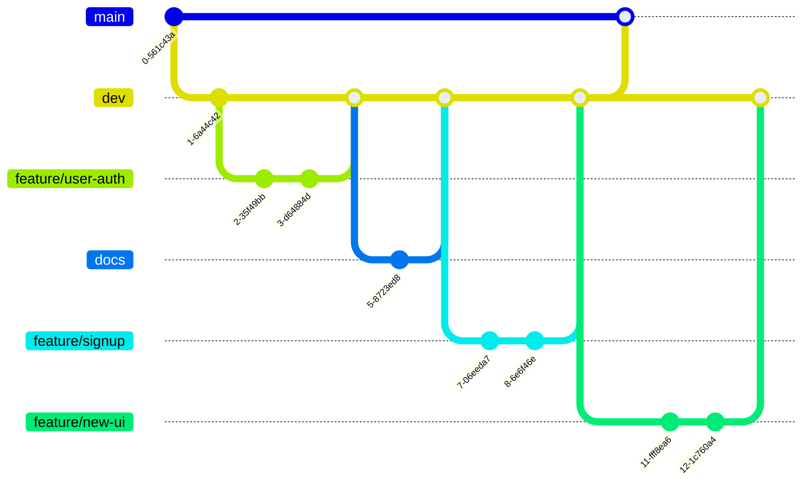

# PatentFlow Shared Agent Guide

This document contains shared rules for frontend, backend, and AI-agent developers working on PatentFlow.

Use this file for cross-team alignment. Use role-specific files such as `AGENTS.md` for frontend-only implementation details.

## Project Overview

PatentFlow is an internal patent management AI workflow system.

- Service name: PatentFlow
- Team name: SYUUK
- Topic: Internal patent management AI
- Product role: AI-assisted patent review workflow
- Goal: Help legal/patent management teams and business departments review company-owned patents around annual fee payment points.
- Product nature: Human-in-the-loop decision-support workflow system, not a simple report generator.

Core workflow:

```text
Review target identification
→ Patent understanding
→ AI patent evaluation report generation
→ Review and decision recording
→ Mailing / delivery
→ History management
→ Abandoned patent sales-candidate management
```

## Backend Deployment Profile

- For the current EKS demonstration environment, keep `SPRING_PROFILES_ACTIVE=demo`.
- In this project, the `demo` profile is not disposable fake data. It loads presentation-ready workflow state around the real SK AX patent metadata used by the team.
- The seeded patent metadata comes from managed project sources such as `docs/skax_patents_list.md` and `src/main/resources/db/seed/skax_patents.sql`.
- Do not change the EKS deployment profile from `demo` to `prod` unless the team explicitly decides to stop loading the demonstration workflow seed data.
- With `demo`, `LocalDemoSeedRunner` runs and `BootstrapAdminInitializer` does not run. Therefore bootstrap admin environment variables are not the source of the initial admin account in the demo deployment.

## Kubernetes Naming Rules

- Team 11 Kubernetes resources must use the `11-team-patentflow-` prefix.
- Use kind-specific suffixes for primary workload exposure resources:
  - Backend Deployment: `11-team-patentflow-be-deployment`
  - Backend Service: `11-team-patentflow-be-svc`
  - Backend Ingress: `11-team-patentflow-be-ingress`
  - Backend ConfigMap: `11-team-patentflow-be-config`
  - Backend Secret: `11-team-patentflow-be-secret`
  - PostgreSQL StatefulSet: `11-team-patentflow-postgres-statefulset`
  - PostgreSQL Service: `11-team-patentflow-postgres-svc`
  - PostgreSQL Secret: `11-team-patentflow-postgres-secret`
  - Agent Service: `11-team-patentflow-agent-svc`
- Keep label selectors app-oriented rather than kind-oriented. For example, backend Pods and Services should share `app: 11-team-patentflow-be`.
- Service-to-service URLs in EKS and Docker Compose must use the shared service-style names, such as `http://11-team-patentflow-agent-svc:8000` and `jdbc:postgresql://11-team-patentflow-postgres-svc:5432/patentflow?currentSchema=patentflow`.
- Do not use legacy Docker Compose service names such as `patentflow-agent` for deployment configuration.

## Shared Domain Rules

- AI output is an evaluation report or recommendation, not the final recorded decision.
- The system must clearly separate `AI 특허 평가 레포트`, `최종 판단`, `사업부 의견`, and `평가 근거`.
- Current evaluation scoring uses only:
  - 권리성
  - 기술성
  - 시장성
  - 사업 연계성
- The system does not include a separate approval step. After business response, the administrator/legal user records the final decision and legal action result directly.
- Business opinion categories are `유지` and `포기`.
- AI report recommendation labels are:
  - 유지 권고
  - 포기 검토
  - 추가 정보 필요
- Workflow status labels should describe process state, such as `사업부 응답 대기`, `사업부 응답 완료`, and `처리 완료`.
- Use `정보 부족 있음`, `추가 확인 필요`, and `N/A` only for missing, insufficient, or not-applicable source data.
- For not-yet-written user input, use state/action copy such as `작성 필요`, `대기 중`, or `의견 대기` instead of `N/A`.
- Checklist totals and detail scores must use the same source. Do not mix AI 0-100 evaluation scores with business checklist 1-4 item scores in one total.

## Quarter, Deadline, And Mailing Domain Rules

- Quarter ranges are fixed by calendar month:
  - Q1: January 1 through the last day of March
  - Q2: April 1 through the last day of June
  - Q3: July 1 through the last day of September
  - Q4: October 1 through the last day of December
- A quarter query includes every patent whose relevant annual-fee/review date falls inside that quarter.
- APIs that list review targets should support quarter filters (`Q1` through `Q4`) and explicit date ranges.
- Business-facing fields, mail templates, and DTO display labels should use `회신 기한`, not `마감 기한`.
- `회신 기한` is a business-response due date configured in bulk by administrators. It is distinct from the internal/legal `실제 마감 기한`.
- Review-request mail is sent by default two months before the quarter start date:
  - Q1 patents: November 1 of the previous year
  - Q2 patents: February 1
  - Q3 patents: May 1
  - Q4 patents: August 1
- The lead time in months must be administrator-configurable. Backend settings/query APIs should return the calculated send date per quarter after the setting is applied.
- Review-request mail payloads, previews, and history records must include the patent original-document URL.
- Country-specific patent views must distinguish domestic patents from overseas patents because annual-fee payment rules differ by country.
- Store or expose enough data to visualize and adjust future annual-fee payment dates, including country, base due date, adjusted due date, and adjustment reason/history.
- 특허 연차료의 기준일은 등록일이 아니라 출원일이다. 연차료 계산, 안내 문구, 필터, mock data, API contract 모두 이 기준을 따른다.
- In business classification, `기존 사업` means an ended business, not an existing/active business.
- Business classification and technology classification must be administrator-editable reference data: add, delete, rename, and reuse across patent records, filters, dashboards, and AI report output.

## Fixed Functional Requirements

Do not change the meaning or numbering of the latest PatentFlow requirement IDs.

### Legal / Admin Requirements

- FR-LEGAL-01: 검토 대상 특허 목록 및 대시보드 요약 조회
- FR-LEGAL-02: 특허 목록 검색·필터링·정렬
- FR-LEGAL-03: 특허 기본 정보 등록 및 외부 정보 기반 입력 추천
- FR-LEGAL-04: 회사 컨텍스트 입력 및 사업/기술 분야 추천
- FR-LEGAL-05: 특허 내용 요약 생성
- FR-LEGAL-06: AI 기반 특허 가치 재평가 수행
- FR-LEGAL-07: 평가 근거 요약 제공
- FR-LEGAL-08: 특허별 종합 권고안 생성
- FR-LEGAL-09: AI 초안, 사람 판단, 실제 법무 처리 결과의 분리 조회 및 수정
- FR-LEGAL-10: 특허별 최종 의사결정 기록
- FR-LEGAL-11: 평가 및 판단 이력 조회
- FR-LEGAL-12: 부서별 수신자 및 메일링 매핑 등록·수정
- FR-LEGAL-13: 메일 발송 전 미리보기
- FR-LEGAL-14: 메일 발송 이력 저장 및 조회
- FR-LEGAL-15: 포기 특허 매각 후보 분류 및 조회
- FR-LEGAL-16: 운영 기준 설정
- FR-LEGAL-17: 특허 리스트 일괄 등록/업로드
- FR-LEGAL-18: AI 작업 진행 상태 조회
- FR-LEGAL-19: 실제 법무 처리 결과 저장 및 추적
- FR-LEGAL-20: 최종 판단 수정 및 취소
- FR-LEGAL-21: 평가 기준 조회 및 수정
- FR-LEGAL-22: 분기 및 날짜 범위 기반 검토 대상 조회
- FR-LEGAL-23: 회신 기한 및 분기별 검토 요청 메일 발송 기준 설정
- FR-LEGAL-24: 국가별 특허 조회 및 미래 연차료 납부 예정일 시각화/조정
- FR-LEGAL-25: 사업 분류 및 기술 분류 기준값 관리

### Business Requirements

- FR-BUS-01: 사업부 의견 입력
- FR-BUS-02: 내부 문서 업로드 기반 재평가 요청 및 문서 관리
- FR-BUS-03: AI 평가 결과 피드백 저장
- FR-BUS-04: 사업부 평가 체크리스트 조회
- FR-BUS-05: 기존 의사결정 기록과 AI 레포트를 병렬 참고하며 사업부 의견 입력

### Common Requirements

- FR-COM-01: 역할별 메뉴·화면·기능 분리 제공
- FR-COM-02: 알림 목록 조회 및 읽음 상태 변경

If new frontend or backend features are needed, define them with a new requirement ID in project documents only. Do not alter existing requirement IDs.

## Shared Reference Docs

Use the project documents in `docs/` as the managed reference set.

- `docs/skax_patents_list.md`: primary source for demo patent metadata and patent list fixtures.
- `docs/PatentFlow_FR_mapping.md`: current FR catalog, legacy FR mapping, UI mapping, and traceability guide.
- `docs/prompt.md`: current BE-FE integration notes and API traceability summary.
- `docs/db_seed_and_status_plan.md`: local/demo seed and DB status update plan.

If implementation details conflict, follow this priority:

1. Explicit user or team decision
2. Fixed functional requirements and shared domain rules
3. Role-specific implementation guide such as `AGENTS.md`
4. Relevant `docs/` reference document

## Patent Metadata Contract

When using demo patent rows or fixtures, first check `docs/skax_patents_list.md`.

Use it as the primary source for:

- 관리번호
- 발명의 명칭(가제)
- 발명의 명칭(최종)
- 관련사업 분야
- 관련기술 분야
- 관련제품
- 출원국
- 공동출원여부
- 공동출원인명
- 상태
- 출원일
- 등록일
- 출원번호
- 등록번호
- 예상 소멸일

If evaluation summaries, recommendations, business opinions, or history are not present in the source document, create clearly marked mock/test data around the real patent metadata. Do not replace real metadata with invented patents.

## Shared Status And Enum Guidance

Prefer explicit domain values and keep Korean labels at the display layer. Frontend status values must match `src/constants/status.ts`.

Use source arrays and derived union types instead of duplicating ad hoc string values in page components:

```ts
const PATENT_LIFECYCLE_STATUSES = ["ACTIVE", "ABANDONED", "SOLD", "EXPIRED"] as const;

const REVIEW_WORKFLOW_STATUSES = [
  "NOT_IN_REVIEW_QUARTER",
  "REVIEW_QUARTER_STARTED",
  "MAIL_READY",
  "WAITING_BUSINESS_RESPONSE",
  "BUSINESS_RESPONSE_RECEIVED",
  "LEGAL_ACTION_RECORDED",
] as const;

const RECOMMENDATIONS = ["MAINTAIN", "REVIEW_AGAIN", "ABANDON", "SALES_CANDIDATE", "HOLD"] as const;

const BUSINESS_OPINION_DECISIONS = ["MAINTAIN", "ABANDON"] as const;

const LEGAL_ACTION_RESULTS = ["MAINTAINED", "ABANDONED", "SOLD"] as const;

const EVALUATION_CATEGORIES = ["RIGHTS", "TECHNOLOGY", "MARKET", "BUSINESS_ALIGNMENT"] as const;
```

Current display labels include:

| Group | Value | Label |
|---|---|---|
| PatentLifecycleStatus | `ACTIVE` | 보유 중 |
| PatentLifecycleStatus | `ABANDONED` | 포기 완료 |
| PatentLifecycleStatus | `SOLD` | 매각 완료 |
| PatentLifecycleStatus | `EXPIRED` | 소멸 |
| ReviewWorkflowStatus | `NOT_IN_REVIEW_QUARTER` | 검토 분기 아님 |
| ReviewWorkflowStatus | `REVIEW_QUARTER_STARTED` | 이번 분기 납부 대상 |
| ReviewWorkflowStatus | `MAIL_READY` | 메일 발송 대기 |
| ReviewWorkflowStatus | `WAITING_BUSINESS_RESPONSE` | 사업부 응답 대기 |
| ReviewWorkflowStatus | `BUSINESS_RESPONSE_RECEIVED` | 사업부 응답 완료 |
| ReviewWorkflowStatus | `LEGAL_ACTION_RECORDED` | 처리 완료 |
| Recommendation | `MAINTAIN` | 유지 권고 |
| Recommendation | `REVIEW_AGAIN` | 추가 정보 필요 |
| Recommendation | `ABANDON` | 포기 검토 |
| Recommendation | `SALES_CANDIDATE` | 포기 검토 |
| Recommendation | `HOLD` | 추가 정보 필요 |
| BusinessOpinionDecision | `MAINTAIN` | 유지 |
| BusinessOpinionDecision | `ABANDON` | 포기 |
| LegalActionResult | `MAINTAINED` | 유지 처리 |
| LegalActionResult | `ABANDONED` | 포기 처리 |
| LegalActionResult | `SOLD` | 매각 처리 |
| EvaluationCategory | `RIGHTS` | 권리성 |
| EvaluationCategory | `TECHNOLOGY` | 기술성 |
| EvaluationCategory | `MARKET` | 시장성 |
| EvaluationCategory | `BUSINESS_ALIGNMENT` | 사업 연계성 |

Workflow progress visualization currently uses this subset and order:

```ts
const REVIEW_WORKFLOW_PROGRESS_STATUSES = [
  "REVIEW_QUARTER_STARTED",
  "MAIL_READY",
  "WAITING_BUSINESS_RESPONSE",
  "BUSINESS_RESPONSE_RECEIVED",
  "LEGAL_ACTION_RECORDED",
] as const;
```

Filter options are `ALL` plus every `REVIEW_WORKFLOW_STATUSES` value. Badge tone values are `neutral`, `primary`, `warning`, `success`, and `danger`.

## Shared API Expectations

Backend and AI services should expose data that lets the frontend display:

- Patent basic metadata
- Why the patent is under review
- Patent summary
- Problem solved by the patent
- Core technical points
- Rights / claims summary
- AI patent evaluation report
- Evaluation scores by current category
- Evidence for each evaluation item
- Missing information or not-applicable fields
- Final decision and legal action result
- Business department opinion
- Evaluation and decision history
- Mailing preview and mailing history
- Abandoned patent sales-candidate information

Frontend API client names may follow these examples:

```ts
getReviewTargetPatents()
getPatentDetail(patentId)
createPatent(payload)
updateCompanyContext(patentId, payload)
requestPatentSummary(patentId)
requestPatentEvaluation(patentId)
submitBusinessOpinion(patentId, payload)
uploadInternalDocumentForReevaluation(patentId, file)
getEvaluationHistory(patentId)
previewMailing(payload)
getMailingHistory()
getSalesCandidates()
```

## Traceability Rules

Important frontend pages, backend APIs, AI-agent prompts, test fixtures, mock data, and major utilities should be traceable to FR IDs.

When a UI relationship is relevant, also include the official UI ID.

Official UI IDs:

| UI ID | 화면명 | 사용자 | 설명 |
|---|---|---|---|
| UI-COM-01 | 로그인 | 공통 | 관리자/사업부 사용자가 로그인하고 역할에 따라 화면 진입 |
| UI-COM-02 | 상태별 특허 리스트 | 공통 | 동일한 workflow 상태의 특허들을 표로 리스트업하고 검색과 정렬을 제공 |
| UI-COM-03 | 알림 패널 | 공통 | 읽지 않은 알림 배지, 오늘/지난주/그 이전 그룹, 읽음 토글 액션 |
| UI-LEGAL-01 | 관리자 대시보드 | 관리자 | 이번 분기 연차료 검토 대상 특허의 KPI와 상세 리스트를 표시 |
| UI-LEGAL-02 | 특허 관리 | 관리자 | 특허를 새로 등록하거나 수정 대상으로 조회하는 페이지 |
| UI-LEGAL-03 | 특허 수정 | 관리자 | 선택한 특허의 기본 정보와 회사 컨텍스트를 수정 |
| UI-LEGAL-04 | 특허 상세 | 관리자 | 특허 요약, AI 레포트, 근거, 권고안, 최종 판단을 확인 |
| UI-LEGAL-04-1 | 특허 상세-1 | 관리자 | 특허 상세의 보조/확장 화면 또는 발표용 세부 화면 |
| UI-LEGAL-05 | 메일링 | 관리자 | 사업부 검토 요청 메일 미리보기, 발송, 발송 이력 조회 |
| UI-LEGAL-06 | 매각 후보 관리 | 관리자 | 포기/매각 대상 특허 후보 목록과 처리 상태 조회 |
| UI-LEGAL-07 | 관리자 설정 | 관리자 | 운영 기준, 평가 기준, 부서/메일링 설정 관리 |
| UI-LEGAL-08 | 사용자 관리 | 관리자 | 관리자와 사업부 사용자 계정/부서 권한 관리 |
| UI-BUS-01 | 사업부서 대시보드 | 사업부서 | 부서에 배정받은 연차료 검토 특허 리스트와 현황 확인 |
| UI-BUS-02 | 사업부서 특허 상세 | 사업부서 | AI 레포트, 특허 요약, 내 사업부 의견 입력 영역 확인 |
| UI-BUS-03 | 사업부서 특허 평가 체크리스트 모달창 | 사업부서 | 기술완성도, 기술 독창성, 시장성, 기대효과 점수와 의견 입력 |
| UI-BUS-04 | 특허별 제출 이력 리스트 페이지 | 사업부서 | 사업 의견을 제출한 특허의 제출 이력 확인 |
| UI-BUS-05 | 특허별 제출 상세 페이지 | 사업부서 | 특허의 제출 상세 이력과 당시 평가 근거 확인 |
| UI-BUS-06 | 사업부 설정 | 사업부서 | 알림, 의견 템플릿, 담당자 정보 설정 |

Do not invent another final UI ID system. If the UI ID is unknown, use `TODO-UI-ID`.

Example comment:

```ts
/**
 * @relatedFR FR-LEGAL-06, FR-LEGAL-07, FR-LEGAL-08
 * @relatedUI UI-LEGAL-04
 * @description AI 특허 평가 레포트와 평가 근거를 조회한다.
 */
```

## Code And Comment Guidelines

- Read the existing structure before changing code.
- Make the smallest safe change that satisfies the request.
- Match existing naming, style, directory structure, and conventions.
- Do not add unnecessary dependencies.
- Do not rewrite, reformat, or refactor unrelated files.
- Do not remove existing behavior unless explicitly requested.
- Keep comments useful and traceable. Prefer FR/UI purpose comments over obvious implementation narration.
- Remove only unused code created by your own change.
- If unrelated cleanup is noticed, report it instead of changing it.

## Work Rules

### Think Before Coding

- Do not assume unclear requirements. State assumptions explicitly, and ask when a reasonable assumption would be risky.
- If multiple interpretations exist, mention the tradeoff before choosing an implementation path.
- If a simpler approach solves the request, prefer it.
- Push back when a requested change conflicts with shared domain rules, FR/UI traceability, or existing project constraints.

### Simplicity First

- Implement the minimum code that satisfies the requested behavior.
- Do not add features, abstractions, flexibility, configuration, or defensive error handling that the task does not need.
- Avoid single-use abstractions unless they clearly reduce real complexity or match an existing pattern.

### Surgical Changes

- Touch only files and lines directly related to the task.
- Do not improve adjacent code unless required for the task.
- Match existing style even when a different style would be personally preferred.
- Every changed line should trace back to the request.

### Goal-Driven Execution

- Convert the request into verifiable success criteria before implementing.
- For bug fixes, prefer reproducing the issue with a focused test or check before changing behavior.
- For refactors, verify behavior before and after when practical.
- Report verification honestly. Do not claim tests passed unless the exact command was run.

## Git Workflow

### Branch Strategy

Use GitHub Flow with a shared `dev` branch before `main`.

```text
feature/name → PR → dev → main
```

Branch roles:

| Branch | Description |
|---|---|
| `main` | 즉각적으로 배포가 가능한 상태 |
| `dev` | `main` 브랜치에 올라가기 전에 기능을 합치고 문제가 있는지 점검 |
| `feature/name` | `dev` 브랜치를 기준으로 생성한다. `name`은 기능 요약을 영어로 적절히 번역하여 작성한다. |
| `fix/name` | `dev` 브랜치를 기준으로 생성한다. 버그 수정이나 작은 보완 작업에 사용한다. |
| `docs` | 문서화 작업 용도로 사용한다. |

Example flow:



### Commit Size

- Keep commits reviewable and focused.
- One commit should not exceed 50 changed lines in a single file when practical.
- Review AI-generated code before committing it.

### Commit Message

Use the Udacity-style prefix format.

- Do not use emojis.
- Write commit messages in Korean.
- Make the first line clear enough to understand the change by itself.

Format:

```text
<커밋_타입>: <수정사항_한줄_요약> (<#이슈넘버>)
```

The issue number is optional and should be used when the commit is tied to a specific bug, task, or issue.

Commit types:

| Type | Description |
|---|---|
| `feat` | 새로운 기능 추가 |
| `fix` | 버그 수정 |
| `docs` | 문서 변경 |
| `style` | 포매팅, 누락된 세미콜론 등 코드 의미 변경 없음 |
| `refactor` | 프로덕션 코드 리팩토링 |
| `test` | 테스트 추가 또는 테스트 리팩토링. 프로덕션 코드 변경 없음 |
| `chore` | 빌드 작업, 패키지 관리자 구성 업데이트 등. 프로덕션 코드 변경 없음 |

Examples:

```text
feat: 특허 상세 AI 평가 레포트 영역 추가 (#12)
fix: 사업부 의견 제출 상태 표시 오류 수정 (#18)
docs: 공통 에이전트 작업 규칙 추가
chore: vite react typescript 환경 설정 (#76)
```

### Pull Request Guide

- Merge into `dev` with squash and merge.
- Merge `dev` into `main` with a normal merge.
- When merging a PR, keep the commit title prefixed with the same commit type format.
- Example: `chore: vite react typescript 환경 설정 (#76)`

## Verification

Use the commands available in each repository. Common frontend commands are:

```bash
npm run lint
npm run build
npm test
```

Backend and AI-agent repositories should use their own test, lint, and build commands.

Before reporting completion, include:

1. What changed
2. Related FR/UI IDs when applicable
3. API or mock assumptions
4. Commands run
5. Remaining TODOs or integration points
